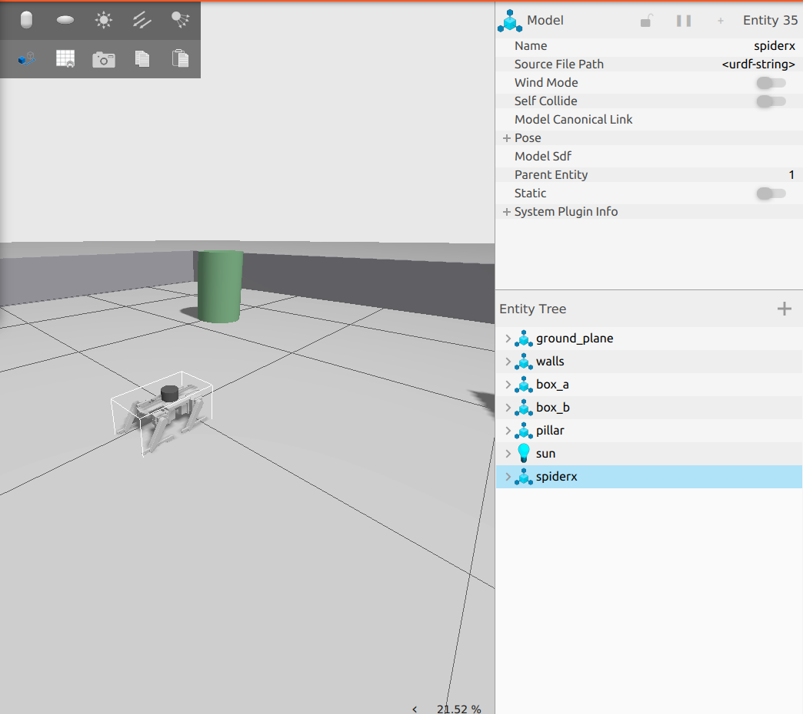
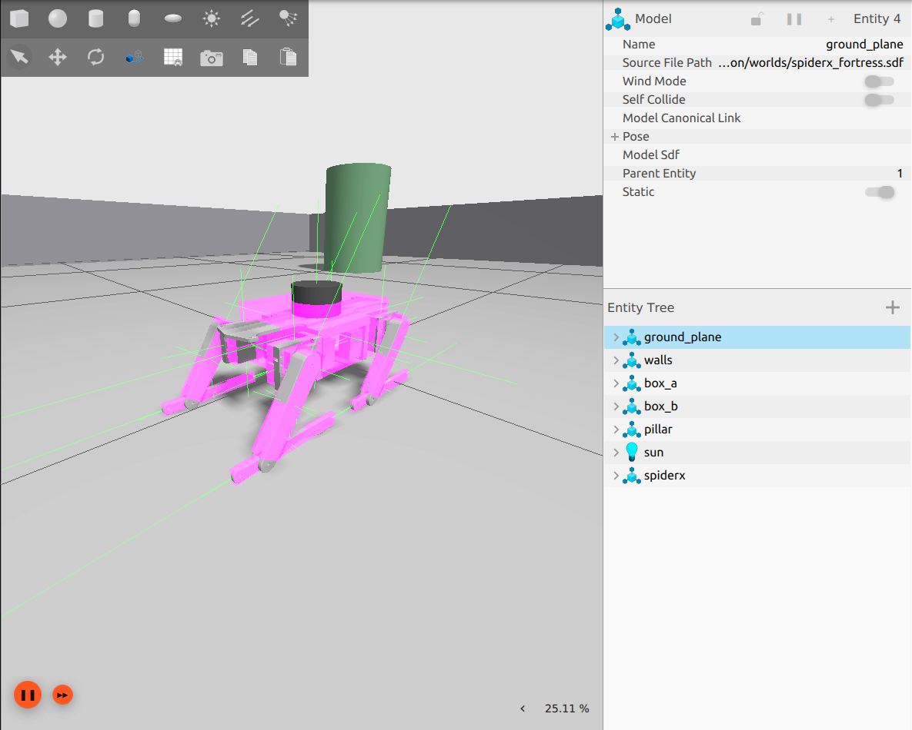
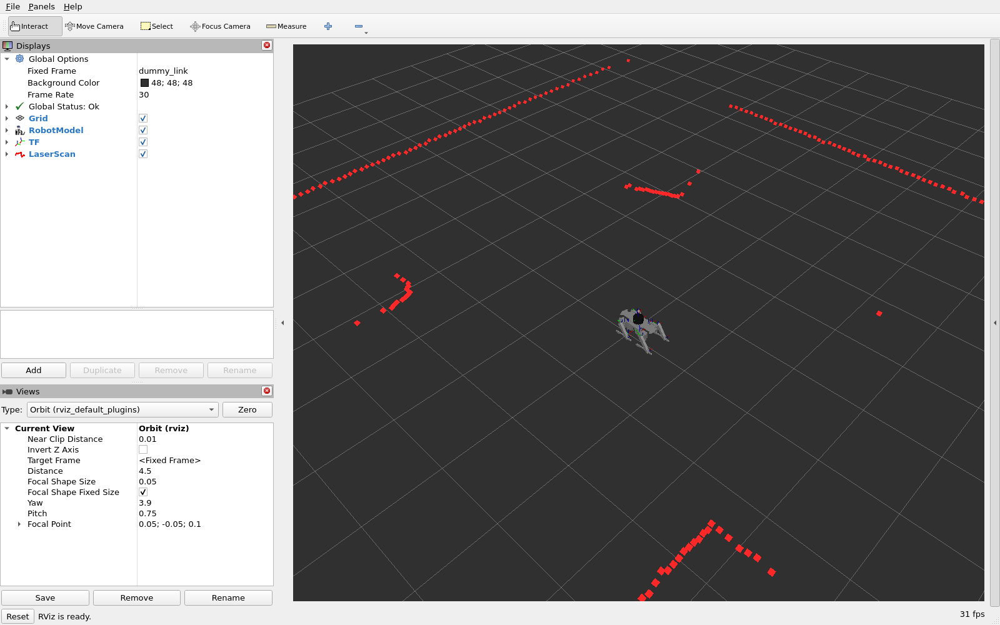
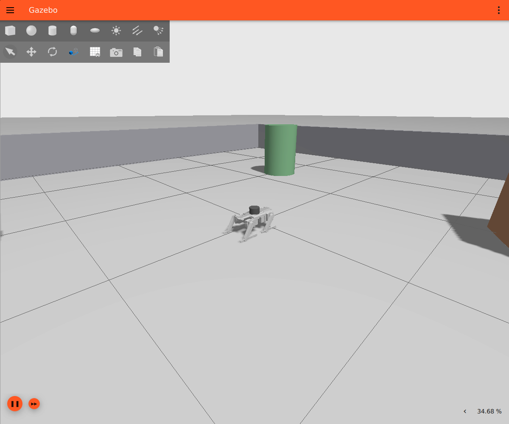
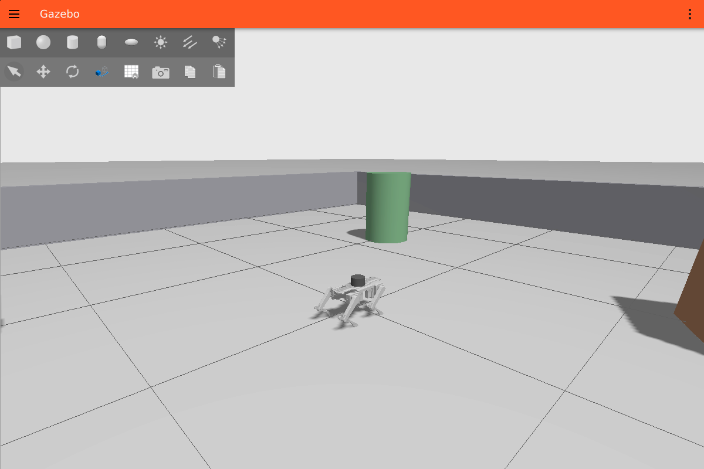

# 🕷️ SpiderX — 12-DOF Quadruped Robot (ROS 2 Humble + Gazebo Fortress)

[](https://docs.ros.org/en/humble/)
[-orange)](https://gazebosim.org/docs/fortress)
[](https://releases.ubuntu.com/22.04/)
[](STATUS.md)
[](src/spiderx_description/package.xml)
[](https://github.com/robovision2210/spiderx_ws)

> SpiderX is a 12-DOF quadruped robot (4 legs × hip / thigh / knee) built from a Fusion 360 CAD
> model. It is organised as a professional multi-package ROS 2 workspace. The audited CAD model
> runs in **Gazebo Fortress** with a simulated 360° lidar on `/scan`, real joint states and a
> complete TF tree, and has been verified on Ubuntu 22.04.
>
> The controller, mapping, localization and navigation packages are laid out and configured, but
> locomotion is not implemented yet. **The robot does not stand, walk or navigate yet.**
> See [STATUS.md](STATUS.md).

---

## 📸 Screenshots

| Gazebo Fortress on Ubuntu 22.04 (local test) | Lidar rays + collision view (local test) |
|---|---|
|  |  |

| RViz: robot model, TF, `/scan` (cloud validation) | Close-up (cloud validation, software rendering) |
|---|---|
|  |  |

Demo GIFs of standing and walking will be added only once those capabilities exist
([media/README.md](media/README.md)).

---

## ✅ Feature Status

| Feature | Status |
|---|---|
| Gazebo Fortress simulation | ✅ Verified (Ubuntu 22.04, locally) |
| URDF / TF (audited CAD model) | ✅ Verified |
| Simulated lidar → `/scan` (`lidar_link`) | ✅ Verified |
| Joint states (`/joint_states`, 12 joints) | ✅ Verified |
| Leg/joint groups, soft limits, config checker | ✅ Verified against the URDF |
| Joint position control (`gz_ros2_control`, 12 joints) | ✅ Verified in simulation, locally and in the cloud (M1): one joint and all-joint neutral-pose trajectory |
| CAD neutral posture hold (simulation only) | ✅ Simulation posture hold verified, locally and in the cloud (M2): 10 s hold, body height, roll and pitch within the documented simulation thresholds. **Not** balance, walking or hardware validation |
| Balance / standing controller | ⚪ Not implemented. M1 and M2 hold joint angles only, with no balance feedback |
| Single-leg FK/IK (front-left, simulation only) | ✅ Verified locally and in the cloud (M3): FK matches the URDF, TF and Gazebo; IK reaches 5 small lifted targets and refuses unreachable or out-of-limit targets. **Not** walking, a gait or hardware validation |
| Gait generation, 4-leg IK, `/cmd_vel` bridge | ⚪ Planned |
| Odometry | ⚪ Planned (never faked) |
| SLAM / AMCL / Nav2 | 🟡 Configured, **blocked until locomotion and odometry exist** |
| Autonomous navigation | ⛔ Blocked until locomotion and odometry exist |
| Real hardware | 🟡 Lidar launch configured; actuators and IMU are future integration |

Full breakdown with evidence: **[STATUS.md](STATUS.md)**

---

## 🏗️ Architecture

```
                 spiderx_description/urdf/spiderx.urdf.xacro   (single source of truth)
                               │
       ┌───────────────────────┴───────────────────────┐
  sim_backend:=fortress                            sim_backend:=none
       │                                               │
 spiderx_bringup/fortress.launch.py               spiderx_bringup/real_robot.launch.py
       │                                               │
 ┌─────┴────────────────────────┐                 ┌────┴───────────────────────────┐
 │ Gazebo Fortress (ros_gz_sim) │                 │ robot_state_publisher          │
 │ robot_state_publisher        │                 │ spiderx_firmware/lidar.launch  │
 │ ros_gz_bridge                │                 │   (RPLidar A1 → /scan)         │
 └─────┬────────────────────────┘                 └────────────────────────────────┘
       │ /scan  /joint_states  /clock  /tf
       ▼
 spiderx_scripts (diagnostics) · RViz (optional)

 Future layers (configured, not running):
 /cmd_vel → [gait + IK] → spiderx_controller (ros2_control) → joints
 /joint_states + IMU → leg odometry → spiderx_localization (EKF) → odom → dummy_link
 spiderx_mapping (SLAM) · spiderx_localization (AMCL) · spiderx_navigation (Nav2)
```

Details: [docs/SPIDERX_SYSTEM_ARCHITECTURE.md](docs/SPIDERX_SYSTEM_ARCHITECTURE.md)

---

## 🦿 Robot Specifications

| Parameter | Value |
|---|---|
| Type | Quadruped, 12 revolute joints (per leg: hip abduction, thigh flexion, knee) |
| Size (CAD pose) | ≈ 0.19 m × 0.36 m × 0.17 m |
| CAD mass | 7.29 kg. **Fusion 360 default steel**, not the real robot ([inertia audit](docs/URDF_INERTIA_AUDIT.md)) |
| Joint ranges (URDF) | Hip span 1.31 rad, thigh span 1.40 rad, knee span 1.13 rad. Signs differ per joint, see [audit §5](docs/SPIDERX_URDF_AUDIT.md) |
| Frames | `dummy_link` (root) → `base_link` (**+y = front**, CAD convention) → legs, `lidar_link` |

### Sensors

| Sensor | Simulation | Topic / frame | Rate |
|---|---|---|---|
| 2D lidar (RPLidar A1-class) | Fortress `gpu_lidar`, 360 × 1°, 0.15–12 m, σ = 1 cm | `/scan` / `lidar_link` | 10 Hz (sim time) |
| IMU | — (future) | `/imu/data` (planned) | — |

---

## 📦 Package Structure

```
spiderx_ws/
├── README.md · STATUS.md
├── docs/                    # architecture, roadmap, hardware, sim-vs-hw, testing, URDF/inertia audits
├── media/                   # local + cloud validation captures, capture list
├── scripts/validate_fortress.sh   # static + runtime validation
└── src/
    ├── spiderx_description/   # CAD URDF/xacro, meshes, Fortress world, bridge config, Classic legacy
    ├── spiderx_bringup/       # fortress.launch.py (simulation) · real_robot.launch.py (hardware) · RViz
    ├── spiderx_controller/    # leg/joint groups, neutral pose, soft limits, ros2_control scaffold, checker
    ├── spiderx_localization/  # EKF + AMCL (configured, blocked)
    ├── spiderx_mapping/       # SLAM Toolbox (configured, blocked)
    ├── spiderx_navigation/    # Nav2 per-server configs + BT (configured, blocked)
    ├── spiderx_firmware/      # RPLidar launch + actuator/IMU interface templates (hardware only)
    └── spiderx_scripts/       # read_lidar, read_joint_states
```

The structure follows [mechaprime_ws](https://github.com/robovision2210/mechaprime_ws), adapted for
a legged robot: [docs/MECHAPRIME_TO_SPIDERX_ARCHITECTURE_PLAN.md](docs/MECHAPRIME_TO_SPIDERX_ARCHITECTURE_PLAN.md).

---

## 🔧 Requirements

- Ubuntu 22.04
- ROS 2 Humble (desktop)
- Gazebo Fortress, via `ros-humble-ros-gz-*`
- A GPU with a working OpenGL driver is recommended

## 🚀 Installation

```bash
git clone https://github.com/robovision2210/spiderx_ws.git ~/spiderx_ws
cd ~/spiderx_ws
sudo apt update && sudo apt install ros-humble-ros-gz-sim ros-humble-ros-gz-bridge ros-humble-ros-gz-interfaces
source /opt/ros/humble/setup.bash
rosdep install --from-paths src --ignore-src -r -y --skip-keys gazebo_ros2_control
colcon build --symlink-install
source install/setup.bash
```

`--skip-keys gazebo_ros2_control` skips the legacy Gazebo Classic dependency.

---

## ▶️ Running the Simulation

```bash
# Terminal 1 — Gazebo Fortress + SpiderX + lidar + bridge
ros2 launch spiderx_bringup fortress.launch.py

# optional: with RViz
ros2 launch spiderx_bringup fortress.launch.py rviz:=true

# M1: the same simulation with gz_ros2_control joint position control
ros2 launch spiderx_bringup fortress_control.launch.py

# M2: M1 plus the Gazebo ground-truth body pose for the simulation-only posture-hold test
ros2 launch spiderx_bringup fortress_posture_hold.launch.py
```

## 🦾 Joint Position Control (M1)

```bash
# Terminal 2, with fortress_control.launch.py running
ros2 control list_controllers        # joint_state_broadcaster + leg_trajectory_controller: active
ros2 run spiderx_controller test_one_joint.py --joint lf_hip --target 0.2 --return-to-initial
ros2 run spiderx_controller test_neutral_pose.py      # all 12 joints -> cad_neutral
./scripts/validate_m1_control.sh --runtime            # automated M1 checks
```

This is joint-position control only. It is **not** standing or walking. See the
[M1 guide](docs/M1_JOINT_POSITION_CONTROL_GUIDE.md) and the [M1 results](docs/M1_TEST_RESULTS.md).


## 🧍 Simulation-Only Posture Hold (M2)

```text
Simulation-only posture hold. Not dynamic balance control. Not walking or gait control.
Not inverse kinematics. Not hardware validation. Not real-servo torque validation.
Not battery/current validation. Not proof of real-world stability.
```

```bash
# Terminal 2, with fortress_posture_hold.launch.py running
ros2 run spiderx_controller run_posture_hold_test.py   # CAD neutral pose, 10 s hold, JSON report
./scripts/validate_m2_posture.sh --runtime             # automated M2 checks
```

The test commands the existing `cad_neutral` pose, holds it for 10 s of simulation time, and measures:
- joint tracking;
- controller states;
- body height, roll and pitch, from Gazebo ground truth.

It then prints either "Simulation posture hold verified." or "Simulation posture hold not verified."

The results are idealised by the placeholder 100 N·m actuator limits and other simulation
assumptions. Foot contact is not measured. See the [M2 guide](docs/M2_SIMULATION_POSTURE_GUIDE.md),
the [M2 results](docs/M2_TEST_RESULTS.md) and the [M2 limitations](docs/M2_SIMULATION_LIMITATIONS.md).



*SpiderX CAD neutral posture hold in Gazebo Fortress — simulation only; not balance or walking.*

## 🦵 Single-Leg Kinematics (M3, simulation only)

```text
Single-leg simulation kinematics validation. Not walking, a gait, balance, locomotion,
real-world leg control or hardware validation.
```

```bash
# Terminal 1: M1 controllers + Gazebo ground-truth pose bridge
ros2 launch spiderx_bringup fortress_posture_hold.launch.py
# Terminal 2
ros2 run spiderx_controller validate_leg_kinematics     # FK vs TF/Gazebo, IK targets, JSON report
./scripts/validate_m3_kinematics.sh --runtime           # automated M3 checks
```

`spiderx_controller/leg_kinematics.py` computes the front-left leg's forward and inverse kinematics
from the **URDF itself**. The foot tip is a derived point, the lowest point of the foot collision
mesh. See the [FK guide](docs/M3_FORWARD_KINEMATICS_GUIDE.md), the
[IK guide](docs/M3_INVERSE_KINEMATICS_GUIDE.md), the [frame conventions](docs/M3_FRAME_CONVENTIONS.md),
the [results](docs/M3_TEST_RESULTS.md) and the [limitations](docs/M3_SIMULATION_LIMITATIONS.md).

## 🔍 Verification

```bash
# Terminal 2 (source ROS 2 and the workspace first)
ros2 topic list                                   # /clock /joint_states /scan /tf /tf_static ...
ros2 topic echo /scan --once | grep -E "frame_id|range_min|range_max"   # lidar_link, 0.15, 12.0
ros2 run tf2_ros tf2_echo base_link lidar_link    # [0.051, -0.045, 0.141]
ros2 run spiderx_scripts read_lidar               # front / left / rear / right distances
ros2 run spiderx_scripts read_joint_states        # 12 joint angles grouped by leg
ros2 run spiderx_controller validate_controller_config
./scripts/validate_fortress.sh                    # static checks
./scripts/validate_fortress.sh --runtime          # launches the sim and checks live topics
```

Step-by-step beginner guide: [docs/SPIDERX_FORTRESS_UBUNTU_TEST_GUIDE.md](docs/SPIDERX_FORTRESS_UBUNTU_TEST_GUIDE.md) ·
all test layers: [docs/SPIDERX_TESTING_GUIDE.md](docs/SPIDERX_TESTING_GUIDE.md)

## 🔌 Real Robot (hardware only)

```bash
ros2 launch spiderx_bringup real_robot.launch.py serial_port:=/dev/ttyUSB0   # RPLidar A1 + TF
```

Never run this for simulation. Servo and IMU integration are templates for now:
[docs/SPIDERX_HARDWARE_INTERFACE.md](docs/SPIDERX_HARDWARE_INTERFACE.md).

---

## 📡 Key ROS 2 Topics

| Topic | Type | Source | Status |
|---|---|---|---|
| `/scan` | `sensor_msgs/LaserScan` | Gazebo lidar / RPLidar | ✅ |
| `/joint_states` | `sensor_msgs/JointState` | Gazebo `JointStatePublisher` | ✅ (sim) |
| `/clock` | `rosgraph_msgs/Clock` | Gazebo | ✅ (sim) |
| `/tf`, `/tf_static`, `/robot_description` | — | `robot_state_publisher` | ✅ |
| `/spiderx/sim/world_poses` | `tf2_msgs/TFMessage` | Gazebo ground truth (M2 test only; **not** `/tf`, not odometry) | ✅ (sim, `fortress_posture_hold.launch.py`) |
| `/cmd_vel` | `geometry_msgs/Twist` | future Nav2 / teleop | ⛔ no consumer yet |
| `/odom`, `/spiderx/leg_odometry`, `/imu/data` | — | future | ⚪ |

---

## ⚠️ Known Limitations

- **No balance.** `fortress.launch.py` is passive, so the legs fold under gravity. `fortress_control.launch.py` (M1) holds the joint angles with stiff placeholder limits, and M2 only verifies that this simulated hold of the CAD neutral pose stays within thresholds. There is no balance or standing controller, and nothing here is validated on hardware.
- **Nothing moves the robot.** Nothing consumes `/cmd_vel` and no odometry exists, so SLAM, AMCL and Nav2 cannot run usefully and are never auto-launched.
- **Frame convention.** `base_link` faces **+y** (CAD convention, not REP-103). A REP-103 base frame is needed before Nav2.
- **Mass properties.** CAD masses use the default steel density; the servo effort/velocity limits in the URDF are placeholders.
- **Speed.** The real-time factor was about 21–25 % on the first local test PC. Check the GPU driver.
- **Headless mode.** `headless:=true` (EGL) has not been tested yet.

## 🗺️ Roadmap

**joint control ✅ (M1) → simulation posture hold ✅ (M2, sim only) → single-leg FK/IK ✅ (M3, sim only, front-left) → gait generator → `/cmd_vel` bridge →
odometry → SLAM → Nav2 → real-hardware validation**

Nav2 comes last because it only decides where to go. It needs a robot that executes `/cmd_vel` and
reports `/odom`. Milestones and acceptance tests:
[docs/SPIDERX_DEVELOPMENT_ROADMAP.md](docs/SPIDERX_DEVELOPMENT_ROADMAP.md)

---

## 🎬 Media to Capture

These are listed in [media/README.md](media/README.md):

- Gazebo Fortress overview
- SpiderX close-up
- `/scan` in RViz
- TF tree (`ros2 run tf2_tools view_frames`)
- Future: standing and walking clips, once implemented

---

## 📚 Documentation

| Document | Content |
|---|---|
| [STATUS.md](STATUS.md) | Verified / configured but blocked / future work |
| [docs/SPIDERX_SYSTEM_ARCHITECTURE.md](docs/SPIDERX_SYSTEM_ARCHITECTURE.md) | Packages, data flow, TF, topics |
| [docs/SPIDERX_DEVELOPMENT_ROADMAP.md](docs/SPIDERX_DEVELOPMENT_ROADMAP.md) | Milestones M0–M9 with acceptance tests |
| [docs/SPIDERX_HARDWARE_INTERFACE.md](docs/SPIDERX_HARDWARE_INTERFACE.md) | Lidar, actuators, IMU, embedded computer |
| [docs/SPIDERX_SIMULATION_VS_HARDWARE.md](docs/SPIDERX_SIMULATION_VS_HARDWARE.md) | What differs, and the rules |
| [docs/SPIDERX_TESTING_GUIDE.md](docs/SPIDERX_TESTING_GUIDE.md) | All test layers |
| [docs/SPIDERX_URDF_AUDIT.md](docs/SPIDERX_URDF_AUDIT.md), [docs/URDF_INERTIA_AUDIT.md](docs/URDF_INERTIA_AUDIT.md) | Model audits |
| [docs/MIGRATION_FORTRESS.md](docs/MIGRATION_FORTRESS.md) | Gazebo Classic → Fortress migration (Classic kept as legacy) |
| [docs/MECHAPRIME_TO_SPIDERX_ARCHITECTURE_PLAN.md](docs/MECHAPRIME_TO_SPIDERX_ARCHITECTURE_PLAN.md) | How the Mechaprime layout was adapted |

---

## 🙏 Acknowledgements

- **ROS 2 Humble**: [ROS 2](https://docs.ros.org/en/humble/), `robot_state_publisher`, `xacro`, `rviz2`
- **Gazebo Fortress** and `ros_gz` (`ros_gz_sim`, `ros_gz_bridge`): [gazebosim.org](https://gazebosim.org/)
- **Nav2**, **SLAM Toolbox** and **robot_localization**, used by the (blocked) navigation stack
- **Slamtec `rplidar_ros`**: RPLidar A1 driver (BSD license), used as a binary dependency (`ros-humble-rplidar-ros`)
- **fusion2urdf**: CAD → URDF export of the SpiderX model
- Workspace layout adapted from [mechaprime_ws](https://github.com/robovision2210/mechaprime_ws)

## 👨‍💻 Author

**Sesha Sai Jagadeswar Patnala**
Robotics & Mechatronics Engineer
[](https://github.com/robovision2210)

## 📄 License

Apache-2.0, as declared in each package's `package.xml`.
